**ตอนที่ 1**

**การติดตั้งโปรแกรม Arduino IDE และไลบรารี (Library)**

การติดตั้ง Arduino IDE สำหรับการเขียนโปรแกรมเพื่อควบคุมการทำงานของไมโครคอนโทรลเลอร์ ESP32 มีขั้นตอนดังต่อไปนี้

1\) ดาวน์โหลดโปรแกรม Arduino IDE ได้ที่ https://www.arduino.cc/en/Main/Software

2\) เลือกรายการ Windows installer, for Windows 10 and newer, 64 bits

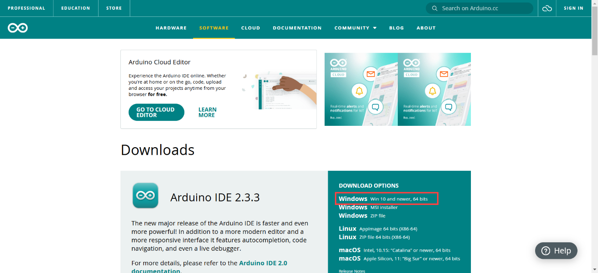

3\) เลือกรายการ JUST DOWNLOAD

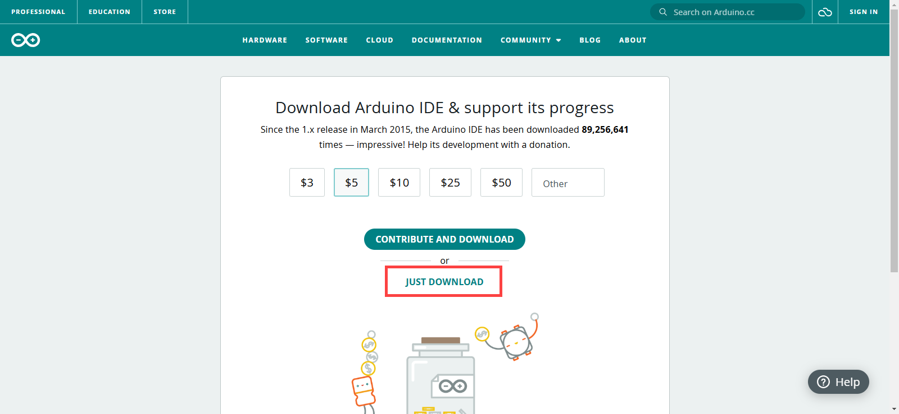

4\) เมื่อดาวน์โหลดโปรแกรม Arduino IDE เสร็จ ให้ทำการดับเบิ้ลคลิกเพื่อทำการติดตั้งโปรแกรม จากนั้นให้คลิกเลือกปุ่ม I Agree เพื่อยอมรับการติดตั้ง ทาการคลิกปุ่ม Next จากนั้นรอจนกว่าโปรแกรมจะทำการติดตั้งเสร็จสิ้น แล้วทำการคลิกปุ่ม Close

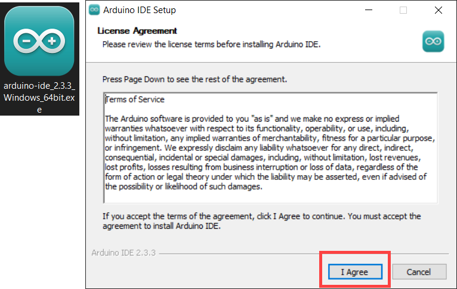

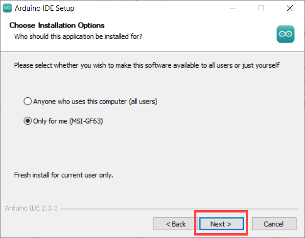

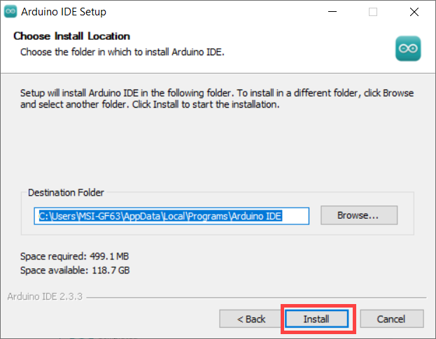

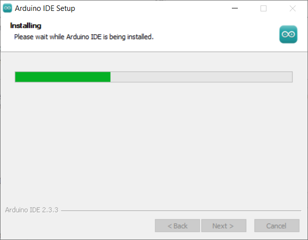

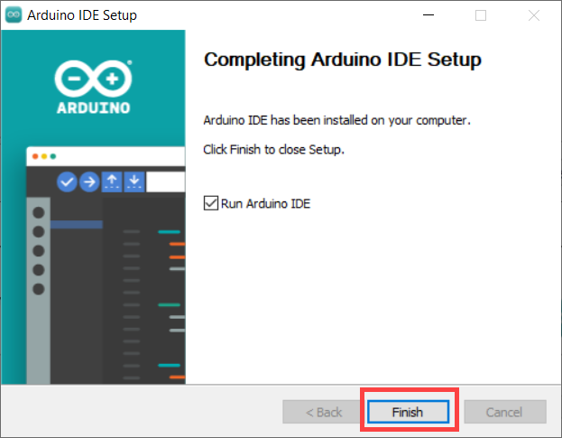

5\) เสียบสาย USB เข้าคอมพิวเตอร์และบอร์ด ESP32


6\) ทำการเช็ค Ports COM โดยเข้าไปที่ Control Panel \> Device Manager ในขั้นตอนนี้อาจจะต้องเสียบสาย Micro USB เข้ากับอุปกรณ์ระบบถึงจะแสดง Ports COM

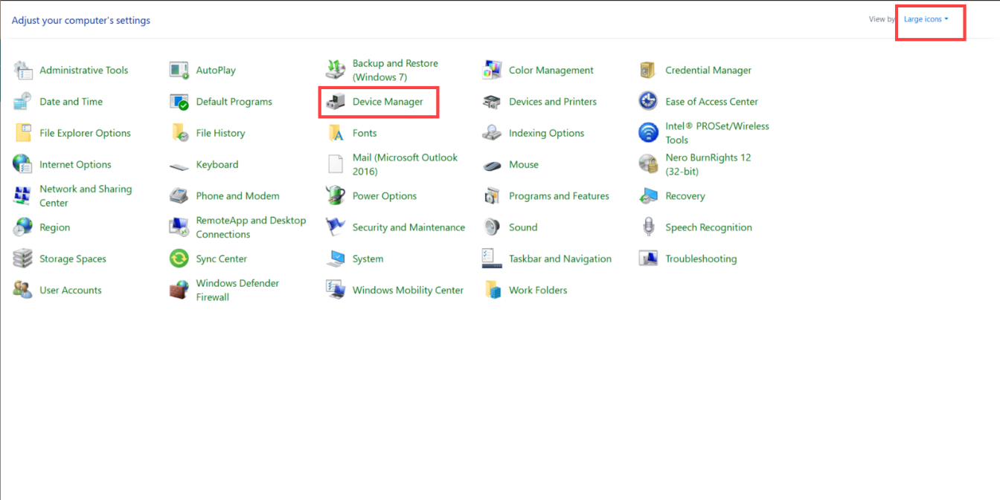

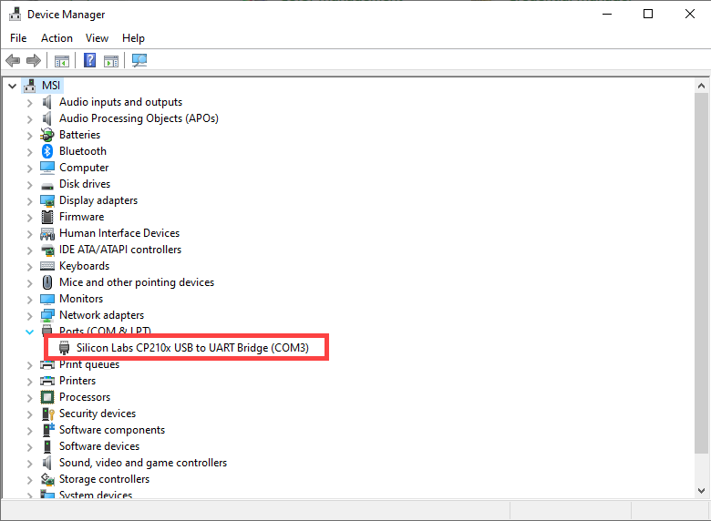

7\) เช็คการเชื่อมต่อระหว่าง Arduino กับ Ports COM โดยเข้าไปที่เมนู **Tools \> Port**

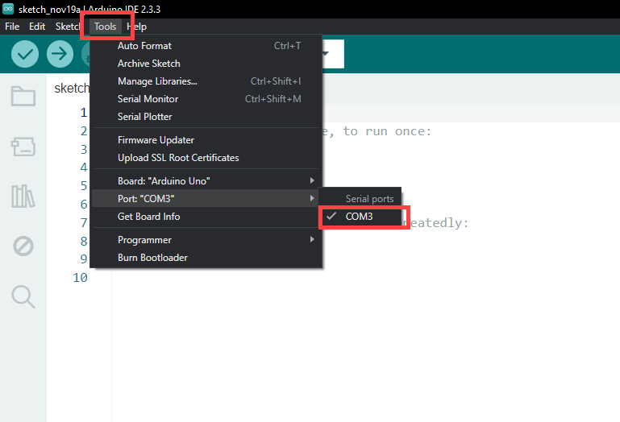

8\) ติดตั้ง ESP32 Package โดยเข้าไป Arduino IDE แล้วเลือกเมนู **File** \> **Preferences**

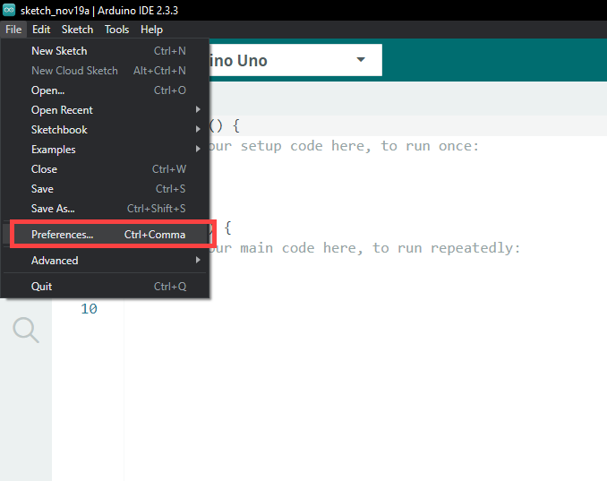

9\) เพิ่มลิงค์ **https://dl.espressif.com/dl/package_esp32_index.json** เข้าไปในช่อง Additional Boards Manager URLs

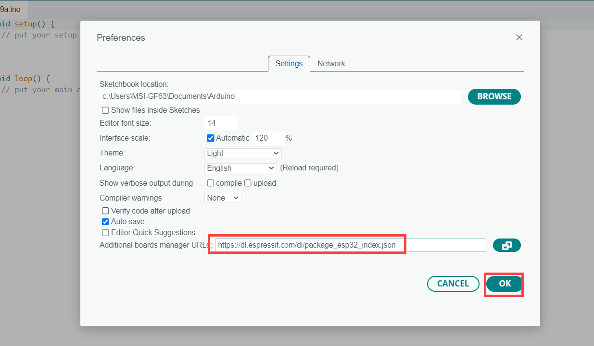

10\) เข้าไปติดตั้ง ESP32 โดยเลือกเมนู **Tools \> Board \> Boards Manager**

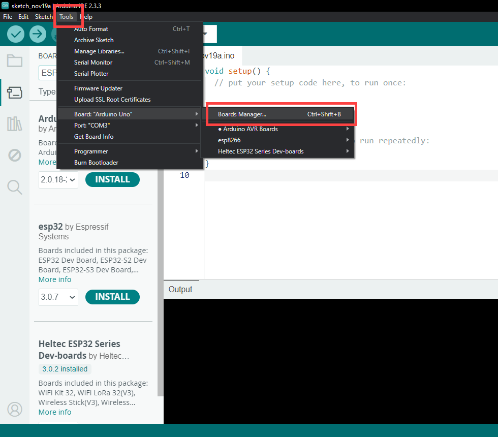

11\) กรอก **ESP32** ในช่องค้นหาและทาการติดตั้ง (คลิกปุ่ม Install) รอจนกว่าโปรแกรมจะทาการติดตั้งเสร็จสมบูรณ์

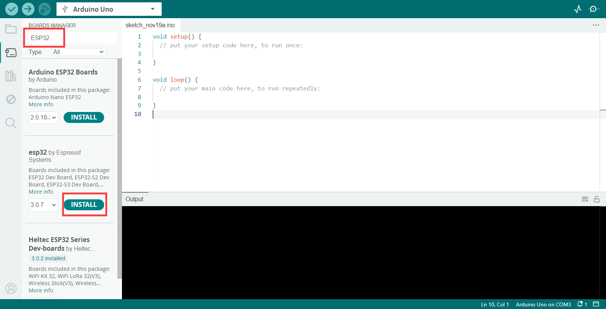

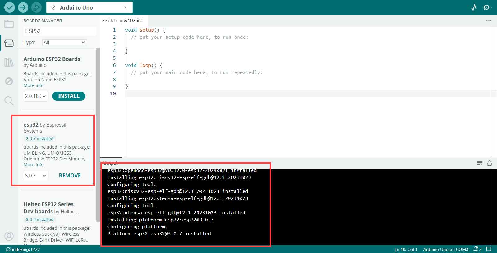

12\) เลือกการเชื่อมต่อ ESP32 โดยเลือกเมนู **Tools \> Board: \> ESP32 Arduino \> ESP32 Dev Module**

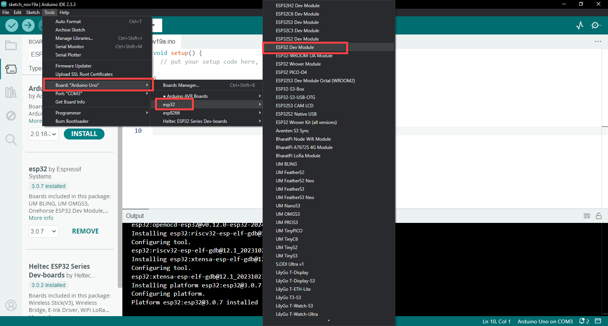

13\) เสียบสาย USB เข้าคอมพิวเตอร์และบอร์ด ESP32 ตรวจสอบการเลือกบอร์ด และเลือก Port COM เพื่อให้พร้อมเขียนโปรแกรม

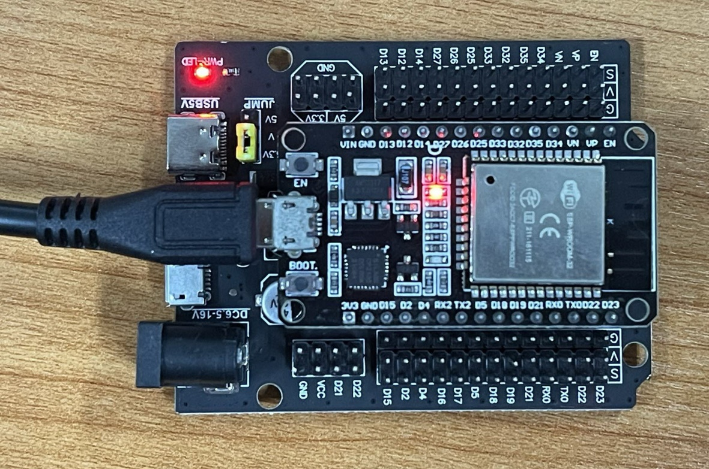

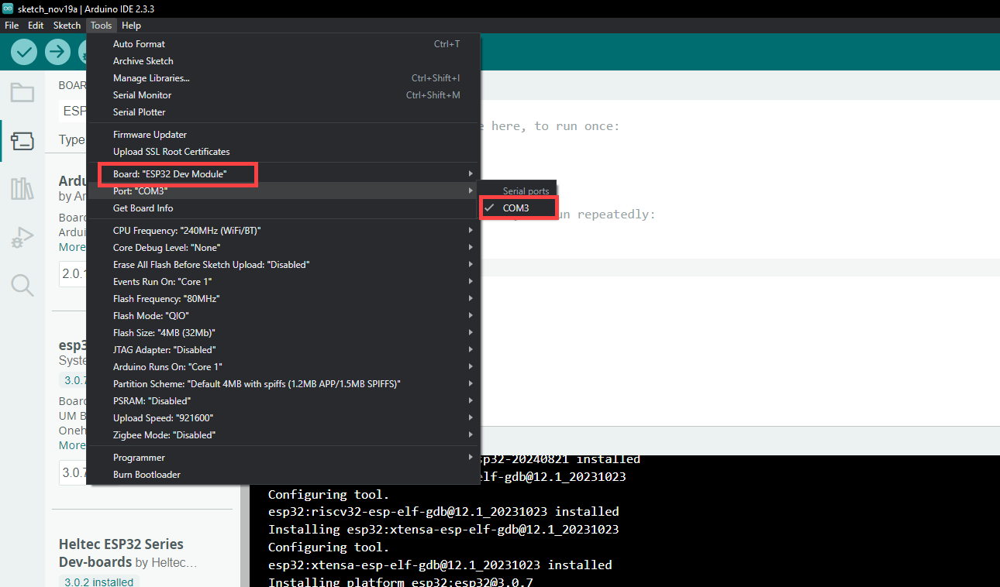

14\) ทดสอบการเขียนโปรแกรมแสดงสถานะไฟ LED

```cpp
void setup() {
pinMode(2, OUTPUT);
}
void loop() {
digitalWrite(2, HIGH);
delay(1000);
digitalWrite(2, LOW);
delay(1000);
}
```

15\) คลิกปุ่มลูกศรเพื่อทำการเขียนคำสั่ง (Upload) ลงในบอร์ดไมโครคอนโทรลเลอร์ ESP32 โดยให้ทำการกดปุ่ม BOOT บน ESP32 ค้างไว้ จนกว่าจะสถานะ Upload ขึ้น จากนั้นรอสถานะ Upload จนเสร็จสิ้น

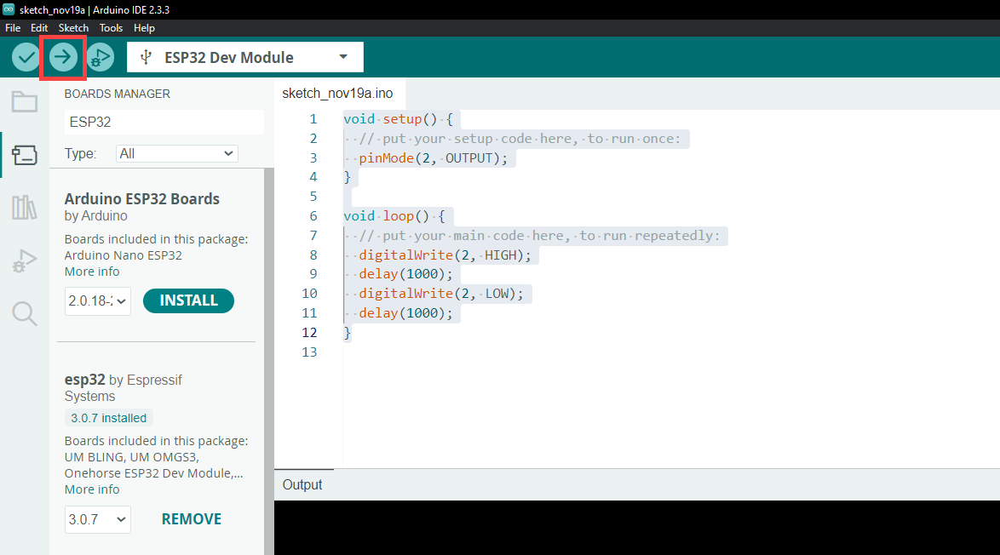

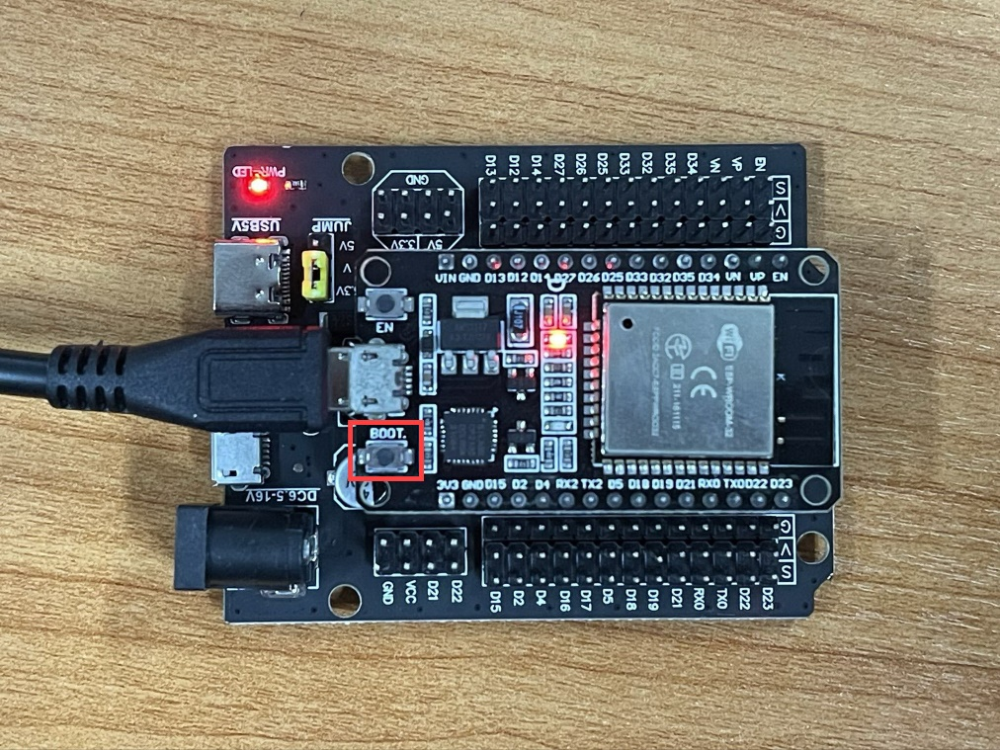

**ตอนที่ 2**

**ทำความรู้จักกับบอร์ด ESP32**

ESP32 เป็นชื่อของไอซีไมโครคอนโทรลเลอร์ที่รองรับการเชื่อมต่อ WiFi และ Bluetooth 4.2 BLE ในตัว ผลิตโดยบริษัท Espressif จากประเทศจีน โดยราคาไม่เกิน 500 บาท (บอร์ดพัฒนาสำเร็จรูป) โดยตัวไอซี ESP32 มีสเปคโดยละเอียด ดังนี้

- ซีพียูใช้สถาปัตยกรรม Tensilica LX6 แบบ 2 แกนสมอง สัญญาณนาฬิกา 240MHz

มีแรมในตัว 512KB

- รองรับการเชื่อมต่อรอมภายนอกสูงสุด 16MB

- มาพร้อมกับ WiFi มาตรฐาน 802.11 b/g/n รองรับการใช้งานทั้งในโหมด Station softAP และ Wi-Fi direct

- มีบลูทูธในตัว รองรับการใช้งานในโหมด 2.0 และโหมด 4.0 BLE

- ใช้แรงดันไฟฟ้าในการทำงาน 2.6V ถึง 3V

- ทำงานได้ที่อุณหภูมิ -40◦C ถึง 125◦C

นอกจากนี้ ESP32 ยังมีเซ็นเซอร์ต่าง ๆ มาในตัวด้วย ดังนี้

- วงจรกรองสัญญาณรบกวนในวงจรขยายสัญญาณ

- เซ็นเซอร์แม่เหล็ก

- เซ็นเซอร์สัมผัส (Capacitive touch) รองรับ 10 ช่อง

- รองรับการเชื่อมต่อคลิสตอล 32.768kHz สำหรับใช้กับส่วนวงจรนับเวลาโดยเฉพาะ

ขาใช้งานต่าง ๆ ของ ESP32 รองรับการเชื่อมต่อบัสต่าง ๆ ดังนี้

- มี GPIO จำนวน 32 ช่อง

- รองรับ UART จำนวน 3 ช่อง

- รองรับ SPI จำนวน 3 ช่อง

- รองรับ I2C จำนวน 2 ช่อง

- รองรับ ADC จำนวน 12 ช่อง

- รองรับ DAC จำนวน 2 ช่อง

- รองรับ I2S จำนวน 2 ช่อง

- รองรับ PWM / Timer ทุกช่อง

- รองรับการเชื่อมต่อกับ SD-Card

นอกจากนี้ ESP32 ยังรองรับฟังก์ชั่นเกี่ยวกับความปลอดภัยต่าง ๆ ดังนี้

- รองรับการเข้ารหัส WiFi แบบ WEP และ WPA/WPA2 PSK/Enterprise

- มีวงจรเข้ารหัส AES / SHA2 / Elliptical Curve Cryptography / RSA-4096 ในตัว

ในด้านประสิทธิ์ภาพการใช้งาน ตัว ESP32 สามารถทำงานได้ดี โดย

- รับ – ส่ง ข้อมูลได้ความเร็วสูงสุดที่ 150Mbps เมื่อเชื่อมต่อแบบ 11n HT40 ได้ความเร็วสูงสุด 72Mbps เมื่อเชื่อมต่อแบบ 11n HT20 ได้ความเร็วสูงสุดที่ 54Mbps เมื่อเชื่อมต่อแบบ 11g และได้ความเร็วสูงสุดที่ 11Mbps เมื่อเชื่อมต่อแบบ 11b

- เมื่อใช้การเชื่อมต่อผ่านโปรโตคอล UDP จะสามารถรับ – ส่งข้อมูลได้ที่ความเร็ว 135Mbps

- ในโหมด Sleep ใช้กระแสไฟฟ้าเพียง 2.5uA

จะเห็นได้ว่า ในราคาไม่ถึง 500 บาท (บอร์ดพัฒนาสำเร็จรูป) และโมดูลเปล่าราคาไม่ถึง 400 บาท สามารถให้ประสิทธิ์ภาพได้เกินราคา ด้วยเหตุนี้ ESP32 จึงเหมาะสำหรับนำมาใช้งานมาก ด้วยเหตุผลทางด้านราคา และประสิทธิ์ภาพที่ได้

แสดงประกอบต่างในบอร์ด ESP32

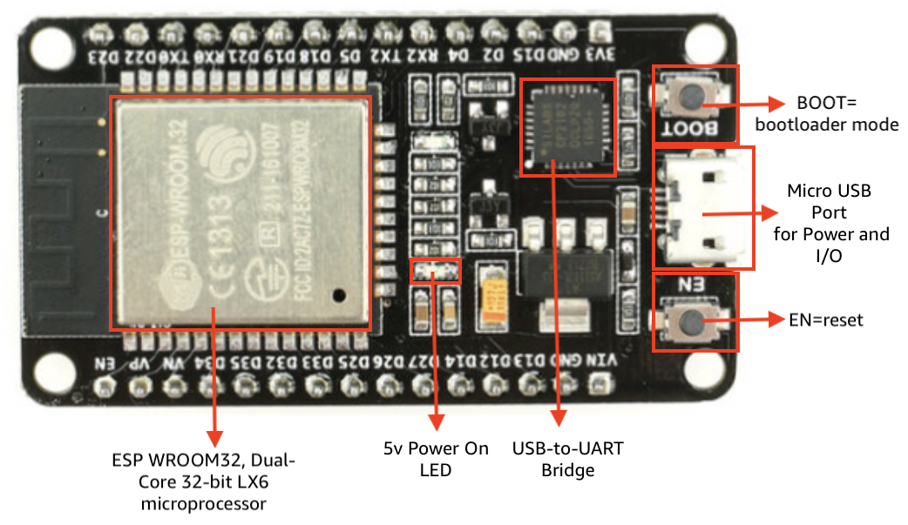

แสดงขาสัญญาณ I/O เป็นส่วนควบคุมการทางานอุปกรณ์ต่าง ๆ

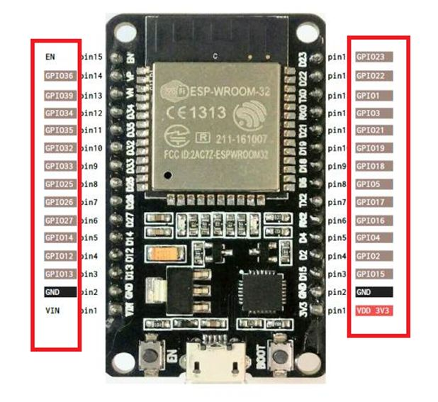

**ตอนที่ 3**

**การใช้งานบอร์ดขยายขา ESP32**

บอร์ดขยายขา ESP32 (ESP32 Expansion Board) เป็นอุปกรณ์เสริมที่ออกแบบมาเพื่อเพิ่มความสะดวกในการใช้งานไมโครคอนโทรลเลอร์ ESP32 ในตัว Expansion Board ทำหน้าที่เสริมความสามารถและช่วยให้การพัฒนาโปรเจกต์เป็นไปได้ง่ายและรวดเร็วยิ่งขึ้น

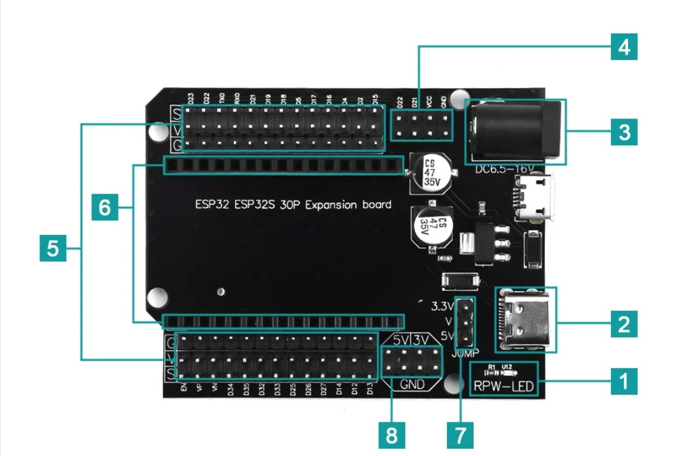

1\. ไฟ LED Power 1 ดวง

2\. ช่องต่อไฟเลี้ยง 5V แบบ USB Type-C และ Micro USB

3\. ช่องต่อไฟเลี้ยง 6.5-16V แบบ DC Jack 5.5x2.1mm

4\. ช่องต่อสัญญาณแบบ I2C 2 ช่อง

5\. อินเตอร์เฟสขยายขาของบอร์ด ESP32 แบบ GVS

6\. ช่องต่อกับบอร์ด ESP32

7\. ช่องไฟออก 5V / 3.3V และกราวน์

8\. ช่องไฟออก 5V / 3.3V และกราวน์

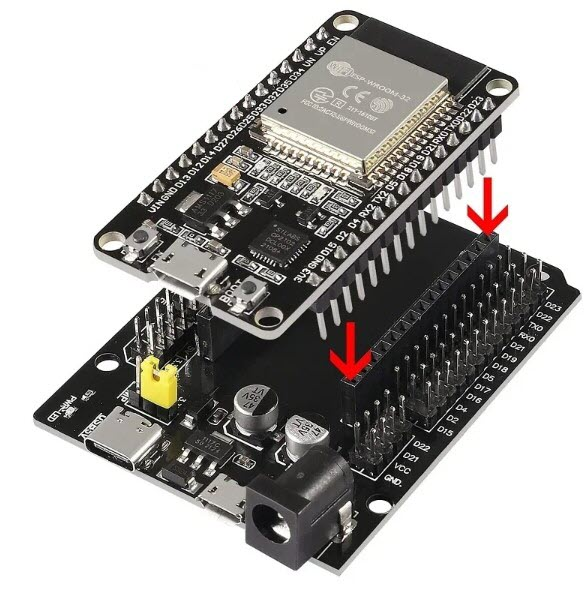

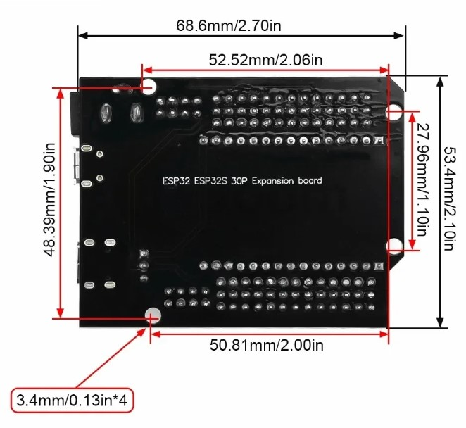
