**ตอนที่ 4**

**ทำความเข้าเริ่มต้นเกี่ยวกับการเขียนโปรแกรม Arduino**

โปรแกรมของ Arduino แบ่งได้ เป็นสองส่วนคือ ภาษาซีของ Arduino จะจัดรูปแบบโครงสร้างของการเขียนโปรแกรมออกเป็นส่วนย่อยๆหลายๆส่วน โดยเรียกแต่ละส่วนว่า ฟังก์ชั่น และ เมื่อนำฟังก์ชั่น มารวมเข้าด้วยกัน ก็จะเรียกว่าโปรแกรม โดยโครงสร้างการเขียนโปรแกรมของ Arduino นั้น ทุกๆโปรแกรมจะต้องประกอบไปด้วยฟังก์ชั่นจำนวนเท่าใดก็ได้ แต่อย่างน้อยที่สุดต้องมีฟังก์ชั่น จำนวน 2 ฟังก์ชั่น คือ setup() และ loop()

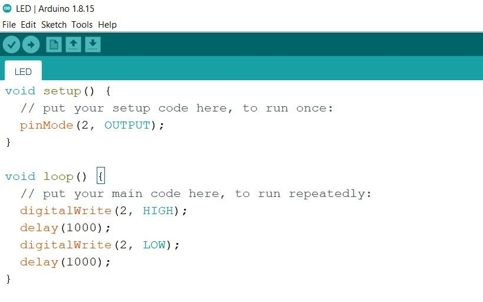

- ฟังก์ชัน **Setup** คือฟังก์ชันหลักสำหรับการทำงาน จะทำงานเพียง 1 ครั้งหลังจากได้รันโปรแกรมและจะทำการไปทำงานในฟังก์ชันถัดไป คือ ฟังก์ชัน Loop

- ฟังก์ชัน Loop คือฟังก์ชันการทำงานของฟังก์ชัน Loop จะทำงานวนซ้ำไปเรื่อยๆ เรียนว่า infinite loop การทำงานที่ไม่มีสิ้นสุด

**วิธีใช้งาน Arduino สื่อสารแบบอนุกรม เพื่อรับและแสดงผลข้อมูลระหว่าง Arduino กับเครื่องคอมพิวเตอร์**

การติดต่อบอร์ด Arduino กับเครื่องคอมพิวเตอร์ สามารถทำได้ทางมาตรฐานสื่อสารแบบ Serial ใน Arduino จะใช้ 2 ขา คือ rx,tx ผ่านวงจร usb ttl เพื่อสื่อสารกับเครื่องคอมพิวเตอร์ ทำให้เราสามารถส่งข้อความจากบอร์ด ESP32 ออกมาแสดงผลทางหน้าจอ ที่เมนู Serial Monitor ใน Arduino IDE และสามารถรับค่าจาก keyboard หรือจากในเครื่องคอมพิวเตอร์ส่งมาเป็นอินพุตให้กับบอร์ด ESP32 ได้ด้วยเช่นกัน

โดยการสื่อสารแบนี้จะมีการกำหนดความเร็วในการรับส่ง ซึ่งจะต้องมีความเร็วที่ตรงกันทั้ง 2 ฝั่งจึงจะสามารถติดต่อกันได้ถูกต้อง การกำหนดความเร็วในการส่งข้อมูลเราเรียกว่า Boaudrate

โดยทั่วไปจะกำหนดความเร็วในการติดต่อดัง เช่น

300 , 1200 , 2400 , 4800 , 9600 , 14400 , 38400 , 57600 , 115200 , 230400 , 460800 , 921600 ทั้งนี้ขึ้นกับอุปกรณ์ว่ารองรับการสื่อสารได้ที่ความเร็วไหนได้บ้าง

การเริ่มติดต่อทำได้โดยคำสั่ง Serial.begin(9600);

ตัวเลข 9600 คือการกำหนดว่าจะใช้ความเร็วที่ 9600 ซึ่งสามารถเปลี่ยนเป็นค่าอื่นได้ตามค่ามาตรฐานด้านบน ยิ่งค่าสูงก็จะส่งข้อมูลได้รวดเร็วขึ้น

```cpp
void setup() {
Serial.begin(9600);
Serial.println("Arduino Test Serial Monitor");
}
void loop() {
Serial.print(" ON ");
delay(1000);
Serial.print(" OFF ");
delay(1000);
Serial.println(" Enter ");
}
```

คลิกปุ่มลูกศรเพื่อทำการเขียนคำสั่ง (Upload) และให้เปิด Serial Monitor ขึ้นมาแล้วกำหนดอัตราการส่งข้อมูลให้ตรงกับโปรแกรมที่อัพโหลดลง ESP32

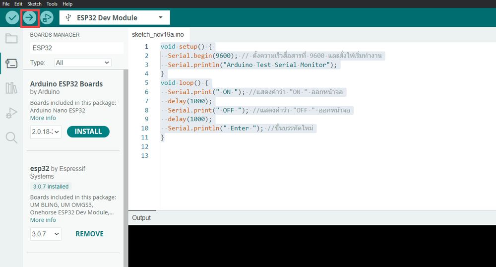

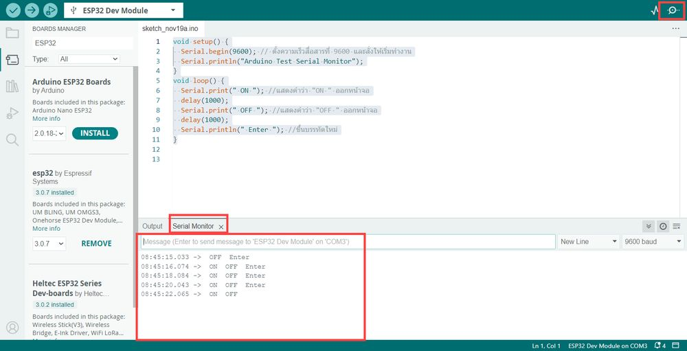

**ตอนที่ 5**

**การเขียนโปรแกรมควบคุมอุปกรณ์ด้วย ESP32**

**การเขียนโปรแกรมควบคุมโมดูลรีเลย์ (Relay)**

1\) ทำการเชื่อมต่อวงจรโมดูลควบคุมโมดูลรีเลย์ ดังต่อไปนี้

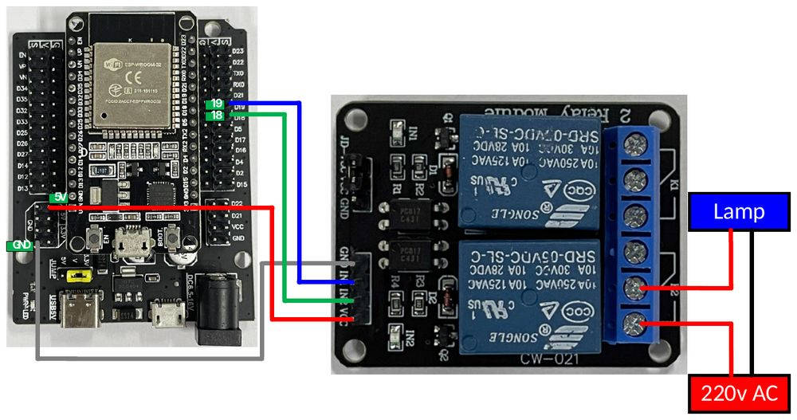

2\) เขียนโค๊ดต่อไปนี้ลงใน Arduino IDE

```cpp
int pin1 = 19;
int pin2 = 18;
void setup() {
pinMode(pin1, OUTPUT);
pinMode(pin2, OUTPUT);}
void loop() {
digitalWrite(pin1, HIGH);
digitalWrite(pin2, HIGH);
delay(2000);
digitalWrite(pin1, LOW);
digitalWrite(pin2, LOW);
delay(1000);
}
```

3\) จากนั้นให้ทำ Save และรันอัพโหลดโปรแกรมลงใน ESP32 สังเกตผลการทำงาน

**การเขียนโปรแกรมควบคุมการทำงานของมอเตอร์**

1\) ทำการเชื่อมต่อวงจรควบคุมการทำงานของมอเตอร์ ดังต่อไปนี้

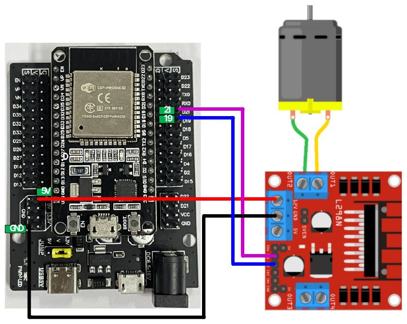

2\) เขียนโค๊ดต่อไปนี้ลงใน Arduino IDE

```cpp
int dir1PinA = 21;
int dir2PinA = 19;
void setup() {
Serial.begin(9600);
pinMode(dir1PinA,OUTPUT);
pinMode(dir2PinA,OUTPUT);
}
void loop() {
digitalWrite(dir1PinA, LOW);
digitalWrite(dir2PinA, HIGH);
Serial.println("Motor 1 Forward");
delay(4000);
digitalWrite(dir1PinA, HIGH);
digitalWrite(dir2PinA, HIGH);
Serial.println("Motor 1 brake");
delay(2000);
digitalWrite(dir1PinA, HIGH);
digitalWrite(dir2PinA, LOW);
Serial.println("Motor 1 Back");
delay(4000);
digitalWrite(dir1PinA, LOW);
digitalWrite(dir2PinA, LOW);
Serial.println("Motor 1 brake");
delay(2000);
}
```

3\) จากนั้นให้ทำ Save และรันอัพโหลดโปรแกรมลงใน ESP32 สังเกตผลการทำงาน

**การเขียนโปรแกรมอ่านค่าจากโมดูลวัดระยะทาง (Ultrasonic)**

1\) หลักการของ Ultrasonic

Ultrasonic sensor คือ อุปกรณ์สำหรับวัดระดับหรือระยะทางชนิดหนึ่งโดยใช้คลื่น Ultrasonic ซึ่งอาศัยหลักการสะท้อนของคลื่นความถี่สูง Ultrasonic โดยอุปกรณ์จะปล่อยคลื่น Ultrasonic ให้กระทบกับวัตถุ จากนั้นรอคลื่น Ultrasonic สะท้อนกับมาที่เซ็นเซอร์เพื่อคำนวณหาระยะทางที่วัดได้

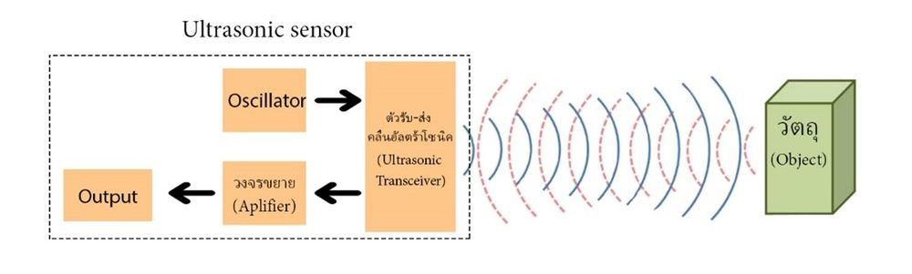

Ultrasonic sensor สามารถคำนวณหาระยะของคลื่น Ultrasonic จะเป็นไปตามสูตรการเคลื่อนที่แนวราบดังนี้

$$S = V_{เสียง}(\frac{t}{2})$$

โดยที่ S = ระยะทาง (m)

V<sub>เสียง</sub> = ความเร็วเสียง (m/s)

t = เวลาในการเดินทางของคลื่น Ultrasonic ทั้งขาไป-ขากลับ (s)

1\) ทำการเชื่อมต่อวงจรอ่านค่าจากโมดูลวัดระยะทาง (Ultrasonic) ดังต่อไปนี้

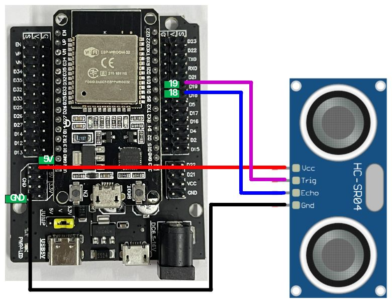

2\) เขียนโค๊ดต่อไปนี้ลงใน Arduino IDE

```cpp
int trigPin = 19;
int echoPin = 18;
long duration;
long distance;
unsigned long previousTime = 0;
void setup() {
pinMode(trigPin, OUTPUT);
pinMode(echoPin, INPUT);
Serial.begin(9600);
}
void loop() {
if((millis() - previousTime) >= 1000){
previousTime = millis();
digitalWrite(trigPin, LOW);
delayMicroseconds(2);
digitalWrite(trigPin, HIGH);
delayMicroseconds(10);
digitalWrite(trigPin, LOW);
duration = pulseIn(echoPin, HIGH);
distance= duration*0.034/2;
Serial.print("Distance: ");
Serial.println(distance);
}
}
```

3\) จากนั้นให้ทำ Save และรันอัพโหลดโปรแกรมลงใน ESP32 สังเกตผลการทำงาน

**แบบฝึกหัด**

ทำการควบคุมการทำงานของมอเตอร์ เมื่อมีสิ่งกีดขวางเซ็นเซอร์ โดยให้ทำการเขียนโปรแกรม มีเงื่อนไขดังนี้

ถ้า **ไม่มี**สิ่งกีดขวางเซ็นเซอร์ ในระยะ 30 cm ให้มอเตอร์**หมุนไปข้างหน้า**

แต่ถ้า **มี**สิ่งกีดขวางเซ็นเซอร์ **น้อยกว่าเท่ากับ 30 cm** ให้มอเตอร์**หมุนถอยหลัง**

แสดงรูปวงจร

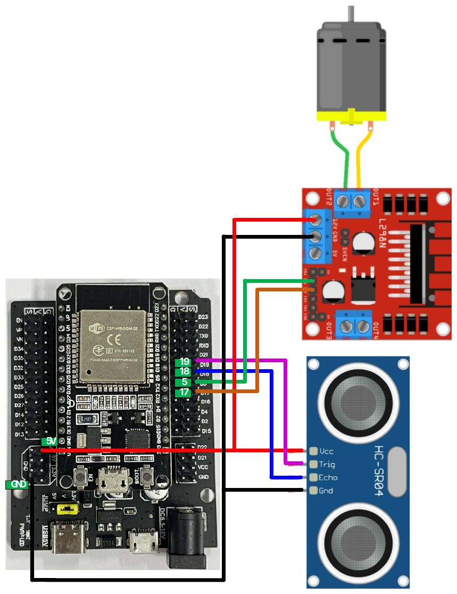

**การเขียนโปรแกรมอ่านค่าจากโมดูลวัดอุณหภูมิและความชื้น (DHT11)**

1\) DHT11 คือ เป็นโมดูลที่สามารถวัดอุณหภูมิและความชื้นบริเวณรอบๆทั่วไปหรือในห้อง หรือประยุกต์ใช้งานอื่นเช่น Testing, Inspection Equipment, Automatic Control, Data Logger, Weather Station, Humidity Regulator ขึ้นอยู่กับการเขียนโปรแกรมและการต่อใช้งานภายนอก ผ่านการสอบเทียบตามมาตรฐาน มีความน่าเชื่อถือ ราคาถูก การตอบสนองที่รวดเร็ว และความแม่นยำในการวัดค่าสูง สามารถใช้งานกับไมโครคอนโทรลเลอร์ทั่วไปได้ ในโมดูลประกอบไปด้วย ส่วนวัดความชื้อแบบ Resistive type และส่วนวัดอุณหภูมิแบบNTC ให้สัญญาณเอาท์พุทแบบ Digital Output, การตรวจวัดคงที่กับ DHT11 Sensor, ย่านวัดอุณหภูมิ 0-50 องศาเซลเซียส, ย่านวัดความชื้น 20-90% RH, ง่ายต่อการติดตั้งใช้งาน

2\) ทำการติดตั้ง library ของ DHT11 ตามวิธีการดังต่อไปนี้

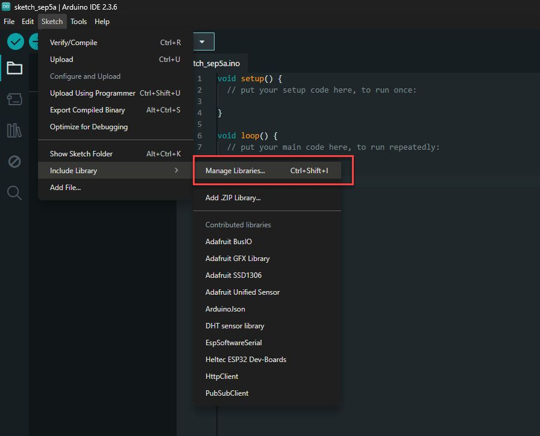

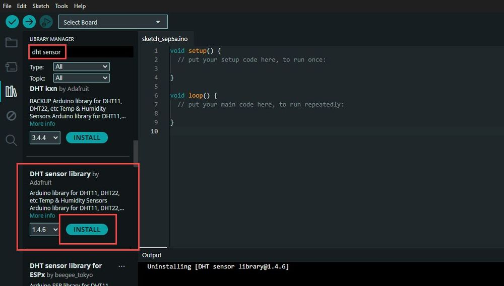

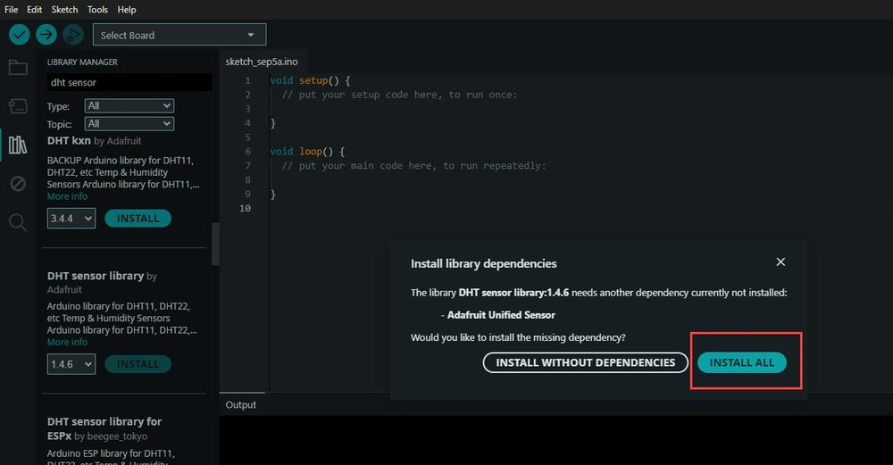

> 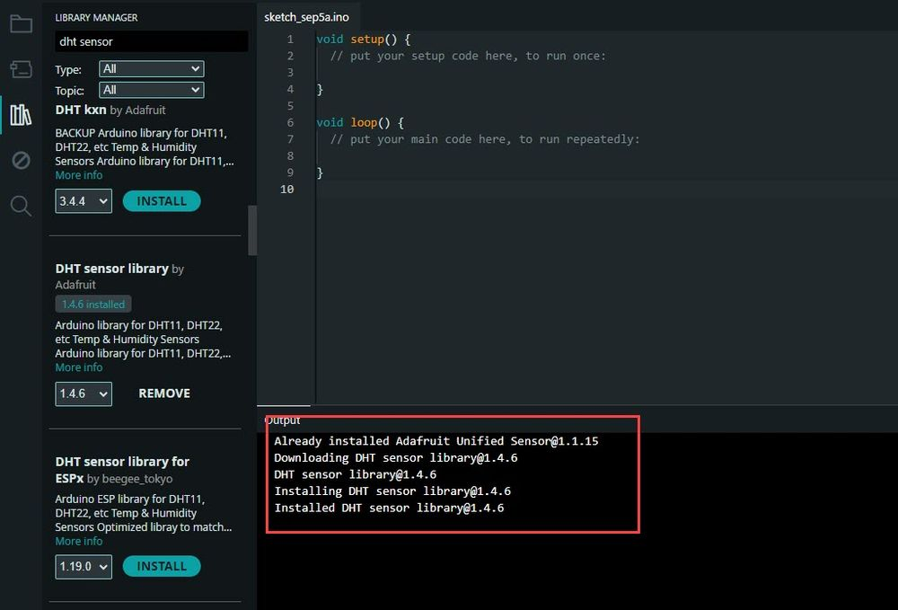

3\) ทำการเชื่อมต่อวงจรอ่านค่าจากโมดูลวัดอุณหภูมิและความชื้น (DHT11) ดังต่อไปนี้

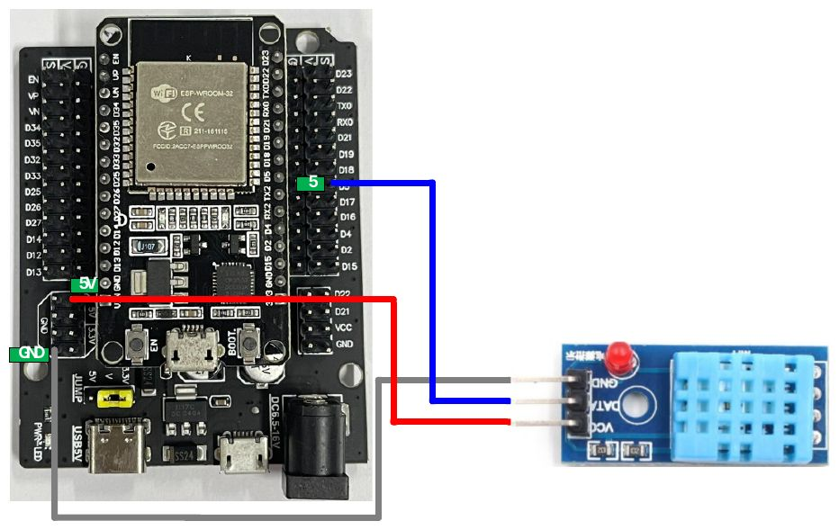

4\) เขียนโค๊ดต่อไปนี้ลงใน Arduino IDE

```cpp
#include "DHT.h"
#define DHTPIN 5
#define DHTTYPE DHT11
DHT dht(DHTPIN, DHTTYPE);
unsigned long previousTime = 0;
void setup() {
Serial.begin(9600);
Serial.println(F("DHTxx test!"));
dht.begin();
}
void loop() {
if((millis() - previousTime) >= 2000){
previousTime = millis();
float h = dht.readHumidity();
float t = dht.readTemperature();
if (isnan(h) || isnan(t)) {
Serial.println(F("Failed to read from DHT sensor!"));
return;
}
Serial.print(F("Humidity: "));
Serial.print(h);
Serial.print(F("% Temperature: "));
Serial.print(t);
Serial.println(F("°C "));
}
}
```

5\) จากนั้นให้ทำ Save และรันอัพโหลดโปรแกรมลงใน ESP32 สังเกตผลการทำงาน
